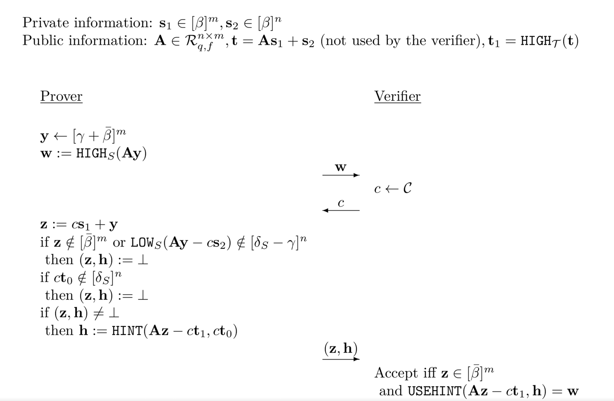
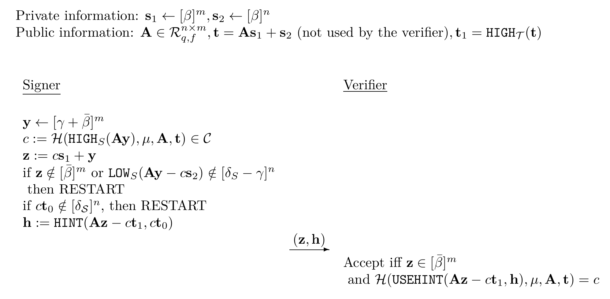
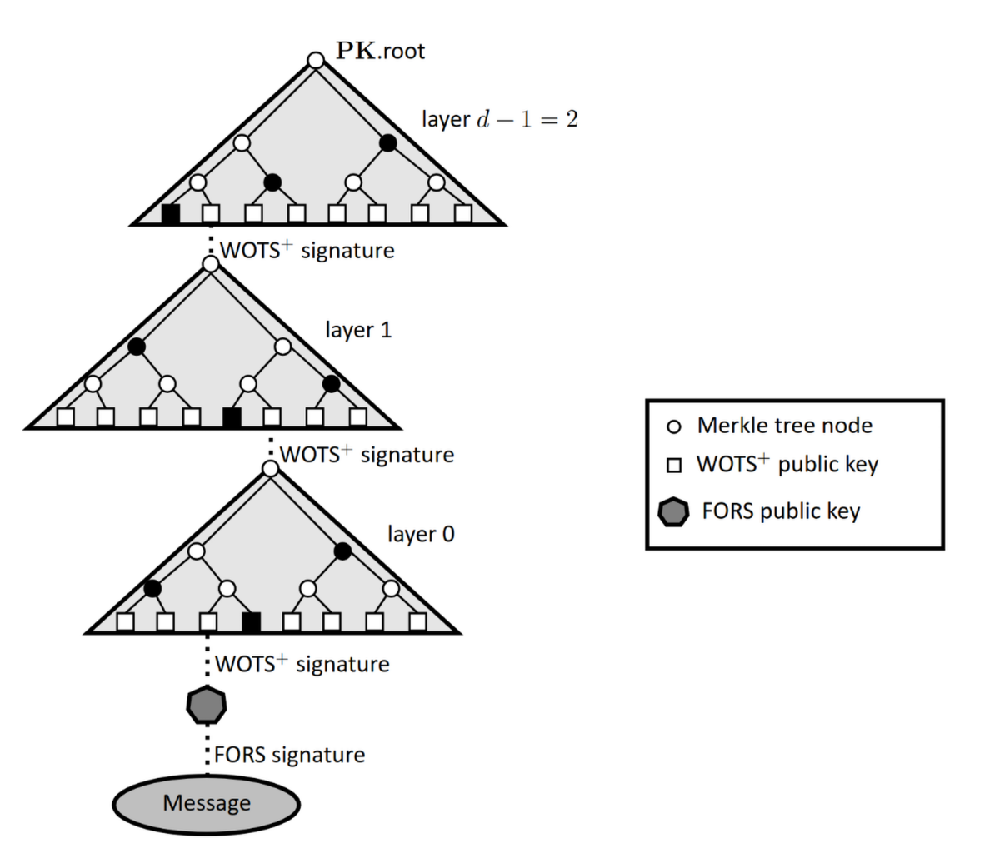
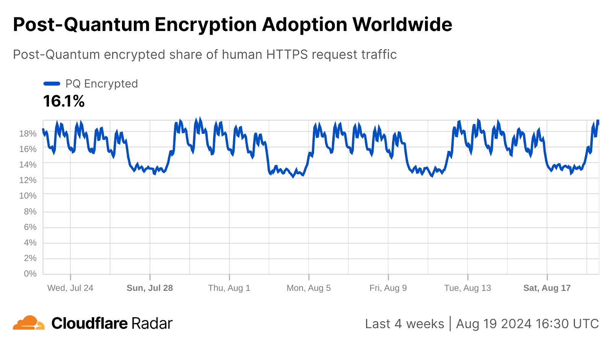
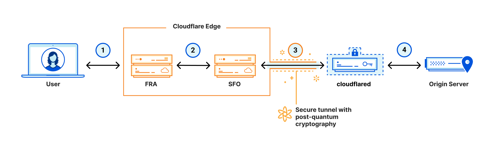
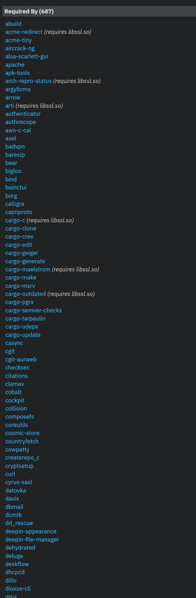

---
# You can also start simply with 'default'
theme: seriph
# random image from a curated Unsplash collection by Anthony
# like them? see https://unsplash.com/collections/94734566/slidev
background: https://cover.sli.dev
# some information about your slides (markdown enabled)
info: |
  ## Slidev Starter Template
  Presentation slides for developers.

  Learn more at [Sli.dev](https://sli.dev)
# apply unocss classes to the current slide
class: text-center
# https://sli.dev/features/drawing
drawings:
  persist: false
# slide transition: https://sli.dev/guide/animations.html#slide-transitions
transition: slide-left
# enable MDC Syntax: https://sli.dev/features/mdc
mdc: true
# open graph
# seoMeta:
#  ogImage: https://cover.sli.dev
---

<!-- markdownlint-disable single-title no-inline-html heading-style blanks-around-headings no-duplicate-heading heading-increment-->

# NIST 的后量子密码算法

Mix

{{ new Date().toLocaleDateString('zh-CN') }}

---

<Toc columns="2" />

---

## 引：Post-Quantum Algorithms in OpenSSL
Sep 17, 2024

> Recently NIST published a number of post-quantum algorithm standards (ML-KEM, ML-DSA, and SLH-DSA). With these new NIST publications, OpenSSL is now prepared for implementation.
>
> - ML-KEM (aka. KRYSTALS-Kyber)
> - ML-DSA (aka. KRYSTALS-Dilithium)
> - SLH-DSA (aka. SPHINCS+)

_<https://openssl-foundation.org/post/2024-09-17-post-quantum/>_

---
layout: center
transition: fade-out
---

## 算法构建

把大象放进冰箱里，一共需要几步？

---

### CRYSTALS-Kyber (ML-KEM)

CRYSTALS (CRYptographic SuiTe for Algebraic Lattices) Kyber 是一种基于模学习与错误问题（Module-LWE, MLWE）的密钥封装机制（KEM），用于安全地交换对称密钥。其构建明确涉及从 CPA 安全的公钥加密方案到 CCA 安全（选择密文攻击安全）的 KEM 的转换，具体过程如下：

- CPA 安全 PKE 方案：Kyber 的基础是一个基于 MLWE (Module Learning with Errors) 的公钥加密方案，操作在环 $\mathcal{R}_{q,f} = \mathbb{Z}_q[X]/(X^{256}+1)$ 上，其中 $q = 2^{23} - 2^{13} + 1$ 是一个支持快速数论变换（NTT）的素数
  1. 密钥生成时，私钥 $\mathbf{s} \in [\beta]^m$ 是一个小系数向量， $\beta$ 为小整数，公钥包括矩阵 $\mathbf{A} \in \mathcal{R}_{q,f}^{m \times m}$ 和向量 $\mathbf{t} = \mathbf{A} \mathbf{s}$。
  2. 加密过程生成密文 $(\mathbf{u}, v)$，其中 $(\mathbf{u}^T = \mathbf{r}^T \mathbf{A})$，$(v = \mathbf{r}^T \mathbf{t} + \mu)$，$(\mathbf{r} \in [\beta]^m)$ 是随机向量，$(\mu \in \mathbb{Z}_q)$ 是消息
  3. 解密通过计算 $(\mu = v - \mathbf{u}^T \mathbf{s})$ 恢复消息。
  
  该方案在 MLWE 假设下是 CPA 安全的，即密文在选择明文攻击下与随机值不可区分。

---
layout: two-cols-header
---

### Fujisaki-Okamoto 变换

为实现 CCA 安全性，Kyber 使用 FO (Fujisaki-Okamoto, 藤崎-冈本) 变换将 CPA 安全 PKE 转换为 KEM（Key Encapsulation Mechanism, 密钥封装机制）。

FO 变换通过在封装和解封装过程中引入哈希函数 $\mathcal{H}$ 和重新加密验证，增强安全性。

- **密钥生成 ($\text{KEM-KeyGen}$)**： $(\text{pk}, \text{sk}) \leftarrow \text{CPA-KeyGen}()$，其中 $\text{pk} := (\mathbf{A}, \mathbf{t})$, $\text{sk} := \mathbf{s}$

::left::

- **封装 ($\text{KEM-Encaps}$)**：
  1. 选择一个随机消息 $m \leftarrow \{0,1\}^{256} \in \mathcal{R}_{X^{256} + 1}$。
  2. 计算 $(K, \rho) := \mathcal{H}(m, \text{pk}) \in \{0,1\}^{512}$，其中 $\mathcal{H}$ 是哈希函数，$K$ 是共享密钥，$\rho$ 是加密随机性。
  3. 使用 CPA-Encrypt 以公钥 $\text{pk}$ 和随机性 $\rho$ 加密 $m$，生成密文 $c$。
  4. 输出共享密钥 $K$ 和密文 $c$。
  
::right::

- **解封装 ($\text{KEM-Decaps}$)**：
  1. 使用 CPA-Decrypt 以私钥 $\text{sk}$ 解密 $\text{c}$，得到消息 $m'$。
  2. 计算 $(K', \rho') = \mathcal{H}(m', \text{pk})$。
  3. 使用 CPA-Encrypt 以 $\text{pk}$ 和 $\rho'$ 重新加密 $m'$，得到密文 $c'$。
  4. 如果 $c = c'$，输出 $K'$；否则，输出一个随机密钥进行隐式拒绝（在 Kyber 中，通常是输入密文和密钥生成时的一个秘密值的哈希）。

---

#### 针对格基加密的一些小修改

FO 变换的直观原理是使 Decapsulation Oracle 对攻击者“无用”，即只有当攻击者已经知道明文的密文被提供时，解封装才会产生非 $⊥$ 的输出。其实现方式是通过使构建密文时使用的随机性依赖于明文(这使得加密方案是确定性的，但不会带来问题，因为我们总是加密随机消息)，并在解封装算法中首先解密密文以获取明文，然后重新加密，如果密文不匹配则输出 $⊥$。

在标准化 ML-KEM（即 Kyber）中，由于格基加密的特殊性，对 FO 变换进行了一些修改。与离散对数方案不同，格基方案中的公钥大小较大（约 1KB），且使用 NTT（Number Theoretic Transform, 快速数论变换， 用于快速计算多项式乘法）的代数运算速度非常快，远超经典密码学中较慢的指数运算或椭圆曲线乘法运算。因此，在封装和解封装函数中对公钥进行哈希操作实际上是一个计算开销显著的操作，当使用 AVX-2 指令实现时，可能占运行时间的 30% 至 50%。由于在许多实际场景中，解封装算法的运行频率高于密钥生成（例如，某方的公钥可能是固定的），我们可以在 KEM-KeyGen 算法中预哈希公钥，计算 $h = \mathcal{G}(pk)$ 并存储它，然后在 KEM-Encaps 算法中使用 $\mathcal{G}(pk)$ 作为 $\mathcal{H}$ 的输入（此处无节省），而在 KEM-Decaps 算法中使用 $h$ 替代 $pk$。在后者中，节省体现在只需哈希 32 字节的数据，而不是约 1KB 的数据。

Kyber KEM 的另一个变化是永远不会输出 $\perp$，而是在密文不匹配的情况下，输出一个随机密钥，该密钥是对输入密文和密钥生成期间创建的某个随机秘密值的哈希。这种设计的理由较为技术化，目前尚不清楚这在实践中是否显著增强了安全性。

---

### CRYSTALS-Dilithium (ML-DSA)

Dilithium (_/daɪˈlɪθiəm/_) 是一种基于 MLWE 和 Ring-SIS 问题的数字签名算法。与 Kyber 不同，Dilithium 并非从 CPA 安全 PKE 方案构建，而是通过 Fiat-Shamir 变换从基于格的零知识证明协议（$\Sigma\text{-protocol}$）衍生。

该协议是零知识的，因为 $\mathbf{z}$ 的分布独立于秘密，且通过拒绝采样避免泄露信息。

---
layout: two-cols-header
---

### Fiat-Shamir 变换

Fiat-Shamir 转换通过哈希函数 $\mathcal{H}(\mathbf{w}, m)$ 模拟随机挑战 $c$，消除了交互性，使 Dilithium 成为高效的数字签名方案。拒绝采样确保签名分布独立于私钥，增强安全性。

::left::

::right::

---
layout: two-cols
---

#### 一些优化措施

1. **消息摘要优化**  
   如果消息 $\mu$ 非常长，那么在每次重启后计算 $\mathcal{H}(\text{HIGH}_S(\mathbf{A} \mathbf{y}), \mu, \mathbf{A}, \mathbf{t})$ 将会显得不必要地低效。因此，合理的做法是首先使用 SHA-512 对原始消息 $\mu'$ 进行哈希，得到一个 512 位的摘要 $\mu$，并结合公钥，仅在签名过程中使用这个摘要。这种方法显著减少了长消息的哈希计算开销。

2. **掩码向量采样优化**  
   为了使掩码向量 $\mathbf{y}$ 的采样尽可能高效（因为每次重启都需要重新采样一次），可以将每个系数的采样范围设置为 2 的幂，即正好 20 位。因此，不是从范围 $[\gamma + \bar{\beta}] = [2^{19} - 1]$ 采样（其中每个系数的定义域大小为 $2^{20} - 1$），而是从集合 $\{ -(2^{19} - 1), \ldots, 2^{19} - 1, 2^{19} \}$ 中采样每个系数。这种调整简化了采样过程，提高了效率。

::right::

3. **提示向量压缩优化**  
   如前所述，另一个优化是对提示向量 $\mathbf{h}$ 进行紧凑表示。根据表 4 中的参数设置，$\mathbf{h}$ 向量中最多有 55 个 1（高概率），因此有 $256 \cdot 6 - 55$ 个 0。如果直接发送 $256 \cdot 6$ 位的字符串，数据量较大。优化的方法是仅指定多项式中 0 的位置（每个非零系数需要 8 位，因此总共 $8 \cdot 55 = 440$ 位），并指定多项式之间的边界（需要 $5 \cdot 6 = 30$ 位），总计 470 位，而不是朴素方法的 $256 \cdot 8 = 1536$ 位。这将签名大小减少到大约 3290 字节。如果 $\mathbf{h}$ 中的非零项超过 55 个，签名者需要重启，但实验表明，这种情况的概率非常小，对运行时间的影响可以忽略不计。

<!-- 这些优化措施显著提高了 Dilithium 的效率，尤其是在处理长消息、采样掩码向量和压缩签名大小方面，同时保持了算法的安全性和实用性。 -->

---
layout: two-cols-header
---

### SPHINCS+ (SLH-DSA)

SLH-DSA（基于 SPHINCS+）结合了 FORS（少次签名）和 XMSS（多次签名，包含 WOTS+）生成签名。

::left::

1. **消息摘要生成**：使用随机化器 $R$（通过 $\text{PRF}_{\text{msg}}$ 和 $\text{SK.prf}$ 生成）和哈希函数 $\text{H}_{\text{msg}}$，对消息 $M$ 计算 $m$ byte 消息摘要。
2. **提取索引**：从摘要中提取 $(k \cdot a)$ 位用于 FORS 签名，$(\lceil (h - h'/d)/8 \rceil)$ 字节用于树索引，$(\lceil h/(8d) \rceil)$ 字节用于叶索引。
3. **FORS 签名**：使用 $\text{fors\_sign}$ 函数对消息摘要进行 FORS 签名，生成 $\text{SIG\_FORS}$。
4. **超树签名**：使用 $\text{ht\_sign}$ 函数对 FORS 公钥生成 XMSS 超树签名，生成 $\text{SIG\_HT}$。
5. **签名输出**：签名包括 $\text{SIG\_FORS}$ 和 $\text{SIG\_HT}$，验证者通过验证 FORS 签名和超树签名来确认签名有效性。

SLH-DSA 的无状态性通过使用大量一次性密钥对（由 FORS 和 XMSS 管理）实现，每次签名使用密钥结构的唯一部分。签名大小较大（例如，17,088 字节），但其基于哈希函数的特性使其被认为高度抗量子攻击。

::right::

---
layout: center
transition: fade-out
---

## 采用状态

这么好的算法到底是谁在用？

---

### Cloudflare

Cloudflare 是一家领先的互联网基础设施公司，致力于提升网站和应用程序的安全性、性能和可靠性。它通过以下核心服务实现这一目标：

- **内容分发网络（CDN）**：Cloudflare 在全球运营服务器网络，将内容缓存到离用户最近的节点，减少延迟，提升加载速度。
- **安全防护**：提供 DDoS 防护、网络应用程序防火墙（WAF）和 SSL/TLS 加密，有效抵御网络威胁。
- **性能优化**：支持图像优化、HTTP/2 和负载均衡等功能，加速网站运行。

凭借超过 335 个城市的数据中心，Cloudflare 为数百万网站提供支持，每天处理数十亿次请求。它易于集成（通常只需更改 DNS），并提供免费套餐，适合各种规模的用户，是优化在线体验的理想选择。

---
layout: two-cols
---

#### Cloudflare 的量子安全计划

为了抵御「收割现在，解密未来」的威胁，Cloudflare 在 2022 年 NIST 宣布首批标准化算法后，与行业合作伙伴合作，部署了 ML-KEM 的初步版本，以保护到达 Cloudflare 服务器的流量，以及他们的内部系统，既为采用最终标准铺平道路，也为尽快保护流量提供支持。

截至 2024 年 8 月中旬，超过 16% 的人类生成请求到 Cloudflare 的服务器已经受到量子安全加密的保护。

::right::

同时 Cloudflare Tunnel 作为一种由 Cloudflare 提供的服务，旨在帮助用户将内部网络中的服务器安全地暴露到互联网上，而无需开放入站端口或进行复杂的防火墙配置，也同时受到量子安全加密的保护。

Cloudflare Tunnel 集成了实验性的后量子密钥交换协议，例如 `X25519Kyber512Draft00` 和 `X25519Kyber768Draft00`，这些协议结合了经典加密和后量子安全技术。

---
layout: two-cols
---

### OpenSSL

OpenSSL 是一款被广泛使用的开源加密库，提供了包括加密、解密、签名、验证、密钥生成和证书处理等安全功能。它支持多种加密算法，包括对称加密、非对称加密、哈希函数、数字签名和证书等。

在 2025 年 4 月 8 日发布的 OpenssL 3.5.0 ，作为一个重要的长期支持（LTS）版本，引入了许多新功能，包括对 PQC 算法 ML-KEM、ML-DSA 和 SLH-DSA 的支持。支持标志着密码学领域向后量子时代迈出了重要一步。随着量子计算机的潜在威胁日益临近，及早采用这些 PQC 算法对于保护敏感数据的长期安全性至关重要。这一版本的发布为用户提供了前瞻性的工具，帮助他们在未来抵御量子计算带来的风险。

::right::

---

### Golang

**Go** 被广泛用于 Web 服务器（如 Kubernetes、Docker）、命令行工具和云服务，因其高效性和易用性受到开发者的喜爱。它的主要特点包括：

- **并发支持**：通过 goroutines 和 channels 提供轻量级并发。
- **垃圾回收**：自动管理内存，简化开发。
- **跨平台**：支持 Linux、Windows、macOS 等多种操作系统。
- **标准库**：提供丰富的网络、加密和文件操作功能。

Go 1.23（2024 年 8 月发布）引入了对后量子密码学的支持，旨在抵御量子计算机对传统加密算法的潜在威胁。

- Go 1.23 集成了 `X25519Kyber768Draft00`，这是一个混合密钥交换算法，结合了经典的 `X25519` 椭圆曲线密钥交换和后量子安全的 `Kyber768` 密钥封装机制（KEM）。
- 该算法通过 TLS 1.3 协议实现，曲线 ID 为 `0x6399`，提供量子安全的密钥交换。

---
layout: two-cols
---

### 其他框架和语言

#### X25519MLKEM768:

- Default for [Firefox 132+](https://www.mozilla.org/firefox/) on Desktop
- Default for [Chrome 131+](https://www.google.com/chrome/)
- Default for [Edge 131+](https://microsoft.com/edge/)
- Default for recent [Opera](https://opera.com) and [Brave](https://brave.com)
- Cloudflare's [fork of Go](https://github.com/cloudflare/go)
- Default for [Go 1.24+](https://go.dev/doc/go1.24#cryptotlspkgcryptotls)
- [OpenSSL 3.5.0+](https://www.openssl.org/)
- [BoringSSL](https://boringssl.googlesource.com/boringssl/)
- [GnuTLS](https://www.gnutls.org)
  - 3.8.9+ compiled with leancrypto 1.2.0+
  - 3.8.8+ compiled with liboqs 0.11.0+
- [rustls 0.23.22+](https://crates.io/crates/rustls)
- Default for [rpxy 0.9.4+](https://github.com/junkurihara/rust-rpxy)

::right::

- [NGINX](https://github.com/nginx/nginx) compiled with OpenSSL 3.5+ ([instructions](https://github.com/nginx/nginx/issues/288))
- [Open Quantum Safe](https://openquantumsafe.org/)
  - C library: liboqs 0.10.0+
  - OpenSSL provider: oqs-provider 0.7.0+
- [Zig 0.14.0+](https://ziglang.org/)
- [Caddy HTTP server](https://caddyserver.com/)
  - [2.10-beta.4+](https://github.com/caddyserver/caddy/releases/tag/v2.10.0-beta.4)
- [Botan C++ library 3.7.0+](https://botan.randombit.net/)

---
layout: two-cols
---

#### X25519Kyber768Draft00:

- Default for [Chrome 124-130](https://www.google.com/chrome/) on Desktop
  - For older Chrome or on mobile, toggle _TLS 1.3 hybridized Kyber support_ (`enable-tls13-kyber`) in `chrome://flags`.
- Default for [Edge 124-130](https://microsoft.com/edge/)
- [Firefox 124-131](https://www.mozilla.org/firefox) if you turn on `security.tls.enable_kyber` in `about:config`
  - For QUIC/HTTP3, use Firefox 128+ with `network.http.http3.enable_kyber`.
- Cloudflare's [fork of Go](https://github.com/cloudflare/go)
- Default for [Go 1.23](https://github.com/golang/go/issues/67061)
- [BoringSSL](https://boringssl.googlesource.com/boringssl/)
- [GnuTLS](https://www.gnutls.org)
  - 3.8.8+ compiled with liboqs 0.11.0-0.12.0
  - 3.8.7 compiled with liboqs 0.10.1-0.12.  

::right::

- Cloudflare's [fork of QUIC-go](https://github.com/cloudflare/qtls-pq)
- Goutam Tamvada's [fork of Firefox](https://github.com/xvzcf/firefox-pq-demos)
- [Open Quantum Safe](https://openquantumsafe.org/)
  - C library: liboqs 0.5.0-0.12.0
  - OpenSSL provider: oqs-provider 0.5.0-0.8.0
- [Zig 0.11.0-0.13.0](https://ziglang.org/)
- [nginx](https://www.nginx.org/) when [compiled with BoringSSL](https://mailman.nginx.org/pipermail/nginx/2023-August/NOISOYU3QTB2DGIYUBGF7CAMQHDI2QLT.html) ([guide](https://blog.centminmod.com/2023/10/03/2860/how-to-enable-cloudflare-post-quantum-x25519kyber768-key-exchange-support-in-centmin-mod-nginx/))
- [Botan C++ library 3.2.0+](https://botan.randombit.net/) ([instructions](https://github.com/randombit/botan/discussions/3747))

---
layout: center
transition: fade-out
---

## 性能分析

安全性和性能，能不能我全都要？

---
layout: two-cols
---

### Kyber vs. ECDH

Kyber 的性能与椭圆曲线 Diffie-Hellman（ECDH）相当或更优，尤其是在优化实现中。以下是一些关键比较：

- **基准测试**：在一项研究中（OAE Journal），在 Intel Core i7-6700k（4 GHz）上，Kyber512（128 位安全级别）的密钥生成、封装和解封装时间分别为 0.03 毫秒、0.02 毫秒和 0.02 毫秒，与 ECDH NIST P-256 的性能接近（最差情况下慢 10%）。在更高安全级别（256 位），Kyber1024 的性能优于 ECDH。

- **TLS 场景**：在 TLS 1.3 握手中，Kyber 的握手时间与 ECDH 相当，网络参数（如往返时间和丢包率）对性能的影响大于算法本身。Kyber 的高效性使其适合资源受限设备（内存 &lt;24 kB，存储 &lt;20 kB）。

- **能量消耗**：研究表明，Kyber512 在密钥交换中的能量消耗略低于 ECDH（Medium Article），使其在移动设备等场景中具有优势。

::right::

- Kyber 与 ECDH 性能比较（Intel Core i7-6700k，4 GHz）

  | 算法 | 安全级别 | 密钥生成 (ms) | 封装 (ms) | 解封装 (ms) |
  | --- | --- | --- | --- | --- |
  | Kyber512 | 128 位 | 0.03 | 0.02 | 0.02 |
  | Kyber1024 | 256 位 | 0.07 | 0.04 | 0.04 |
  | ECDH P-256 | 128 位 | \~0.03 | \~0.02 | \~0.02 |

---
layout: two-cols
---

### Dilithium vs. ECDSA

Dilithium 在签名生成和验证方面表现出色，通常优于 ECDSA，尤其是在等效安全级别下。以下是详细比较：

- **基准测试**：根据一项 arXiv 研究，在 128 位安全级别下，Dilithium-2 的总签名时间（包括生成和验证）为 0.644 毫秒，比 ECDSA P-256（0.801 毫秒）快约 20%。在 256 位安全级别下，Dilithium-5（1.361 毫秒）几乎比 ECDSA P-521（2.398 毫秒）快一倍。

- **签名大小**：Dilithium 的签名大小较大（例如，Dilithium-2 为 2420 字节），而 ECDSA P-256 的签名约为 64 字节。这可能在带宽受限场景中是一个缺点。

- **优化影响**：使用 AVX2 优化的 Dilithium 实现显著提高了性能。例如，在 Skylake CPU（Intel Core-i7 6600U，2.6 GHz）上，Dilithium-2 的签名时间为 333,013 周期（约 128 微秒），而 ECDSA P-256 的签名时间约为 69,524 周期（约 26.74 微秒，假设 2.6 GHz）。

::right::

然而，在实际 TLS 场景中，Dilithium 的整体性能更接近 ECDSA，因为哈希操作占主导地位。

- Dilithium 与 ECDSA 性能比较

  | 算法 | 安全级别 | 总时间 (ms) | 签名大小 (字节) |
  | --- | --- | --- | --- |
  | Dilithium-2 | 128 位 | 0.644 | 2420 |
  | Dilithium-5 | 256 位 | 1.361 | 4595 |
  | ECDSA P-256 | 128 位 | 0.801 | \~64 |
  | ECDSA P-521 | 256 位 | 2.398 | \~132 |

---
layout: two-cols
---

### SLH-DSA vs. ECDSA

SLH-DSA（SPHINCS+）的性能低于 Dilithium 和 ECDSA，主要由于其签名时间较长和签名大小较大。以下是比较：

- **签名时间**：根据 MDPI 研究（MDPI Article），在 Ubuntu 22.04（Intel Core i7-9750H，2.6 GHz）上，SLH-DSA-SHA2-128f-simple 的签名时间（对 10 MB 文件）为 0.05223 秒，而 Dilithium-2 为 0.002592 秒，ECDSA P-256 约为 0.00002674 秒。签名时间随文件大小增加，因为包括了哈希计算。

- **签名大小**：SLH-DSA 的签名大小显著较大，例如 SLH-DSA-SHA2-128f 为 17,088 字节，而 Dilithium-2 为 2,420 字节，ECDSA P-256 为 64 字节。这使其在带宽受限场景中效率较低。

- **密钥生成**：SLH-DSA 的密钥生成时间与 Dilithium 相当，例如 SLH-DSA-SHA2-128f 为 0.7 毫秒，Dilithium-2 为 0.5 毫秒。

::right::

- **安全优势**：SLH-DSA 的哈希基础使其对数学结构攻击（如格问题）免疫，提供更保守的安全保证，可能在某些高安全性场景中更受青睐。

- SLH-DSA 与 ECDSA 性能比较

  | 算法 | 安全级别 | 签名时间 (10 MB, s) | 签名大小 (字节) |
  | --- | --- | --- | --- |
  | SLH-DSA-SHA2-128f | 128 位 | 0.05223 | 17,088 |
  | Dilithium-2 | 128 位 | 0.002592 | 2,420 |
  | ECDSA P-256 | 128 位 | \~0.00002674 | \~64 |

---

### 与 Ed25519 和 RSA 的比较

- **Ed25519**：Ed25519 是一种高效的椭圆曲线签名算法，签名时间通常比 ECDSA 更快。例如，在 Skylake CPU 上，Ed25519 的签名速度为 21,340.9 次/秒（约 46.8 微秒/签名），比 Dilithium-2 更快，但 Dilithium 在更高安全级别下更具优势。

- **RSA**：RSA 的签名性能较差，尤其是在高安全级别下。例如，RSA-2048 的签名时间约为 2.56 秒（对 1 GB 文件，包括哈希），而 Dilithium-2 为 3.31 秒，但 Dilithium 提供量子抗性。RSA 的密钥生成时间也显著高于后量子算法。

---
layout: two-cols-header
---

### 参考文献

谢谢大家！

::left::

- [Post-Quantum Algorithms in OpenSSL | OpenSSL Foundation](https://openssl-foundation.org/post/2024-09-17-post-quantum/)
- [The concepts behind Kyber (ML-KEM) and Dilithium (ML-DSA) - Cryptography ePrint Archive](https://eprint.iacr.org/2024/1287)
- [What's the purpose of implicit rejection - Cryptography Stack Exchange](https://crypto.stackexchange.com/questions/108350/whats-the-purpose-of-implicit-rejection)
- [FIPS 203, Module-Lattice-Based Key-Encapsulation Mechanism Standard | CSRC](https://csrc.nist.gov/pubs/fips/203/final)
- [FIPS 204, Module-Lattice-Based Digital Signature Standard | CSRC](https://csrc.nist.gov/pubs/fips/204/final)
- [FIPS 205, Stateless Hash-Based Digital Signature Standard | CSRC](https://csrc.nist.gov/pubs/fips/205/final)

::right::

- [NIST’s first post-quantum standards - Cloudflare Blog](https://blog.cloudflare.com/nists-first-post-quantum-standards/)
- [Introducing post-quantum Cloudflare Tunnel - Cloudflare Blog](https://blog.cloudflare.com/post-quantum-tunnel/)
- [OpenSSL 3.5 Final Release - Live | OpenSSL Library](https://openssl-library.org/post/2025-04-08-openssl-35-final-release/)
- [Post Quantum Cryptography Web Server in Go 1.23 | by Gil Adda | Medium](https://medium.com/cyberark-engineering/a-post-quantum-cryptography-web-server-in-go-1-23-9f7e98db7b39)
- [PQC support · Cloudflare SSL/TLS docs](https://developers.cloudflare.com/ssl/post-quantum-cryptography/pqc-support/)
- [Performance Analysis of Post-Quantum Cryptography Algorithms for Digital Signature](https://www.mdpi.com/2076-3417/14/12/4994)
- [Comparison of Kyber, NewHope, BLISS, RSA, ECC, and AES on Cortex M-4](https://lukas-prokop.at/articles/2020-07-10-pqcrypto-performance)

